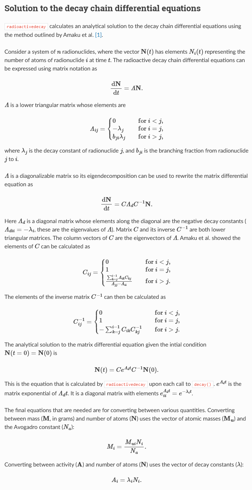
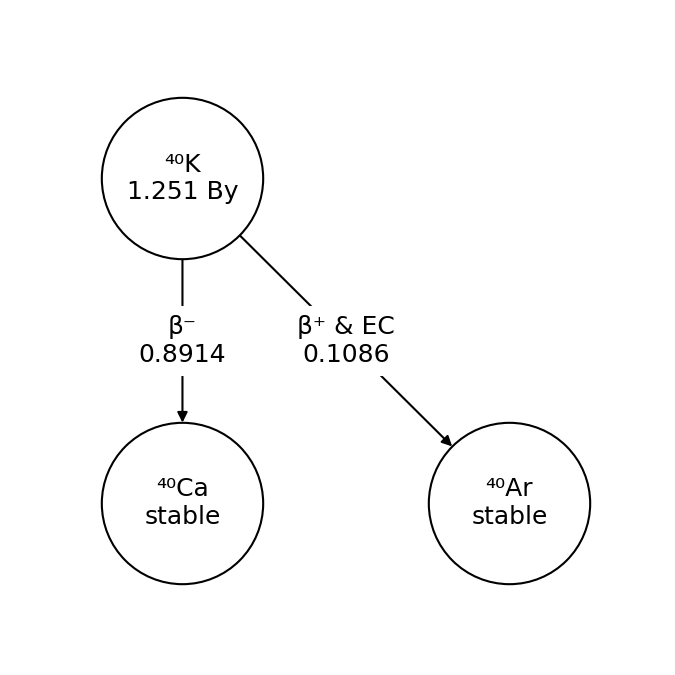
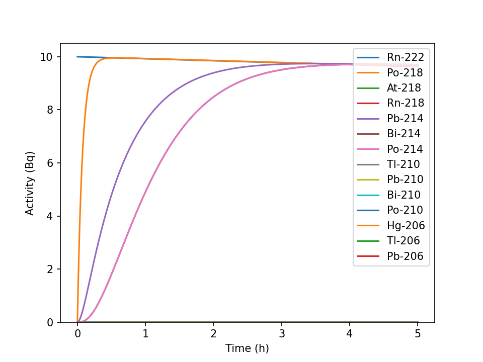

# radioactivedecay: A Python package for radioactive decay calculations

## Links

https://joss.theoj.org/papers/10.21105/joss.03318
https://github.com/radioactivedecay/radioactivedecay

## Purpose
Radioactivedecay is a Python package for modeling radioactive decay. In particular, it offers functionality for calculating the decay chains that have ranching decays and metastable nuclear isomers with high numerical precision. It finds analytical solutions for decay chain differential equations in matrix form. The package models natural radioactive decay processes by multiplying an initial condition by a sparse matrix that represents a differential equation. The process is laid out in the following excerpt from the documentation.





## Stakeholders
Radioactivedecay has applications both in research and industrially. Nearly any situation involving potentially hazardous radioactive material can benefit from an accurate model of decay. Industrial applications can also require the high precision that the package provides, such as medical radiology.

## Metrics and features
This software is very fast, while the paper nor the documentation offer any time analysis my own experimentation never took more than a few seconds to execute.

Radioactivedecay is designed to be able to provide high numerical precision. By default, exponential terms are evaluated numerically to 320 significant figures of precision for decay calculations but this can be changed by the user so provide arbitrarily high precision.


## Using The Software.

As a python package radioactivedecay is easily installed using `pip`.
To get started I followed a tutorial modeling uranium decay.
```
# inventory of nuclides in moles
inv_t0 = rd.Inventory({'U-238': 99.274, 'U-235': 0.720, 'U-234': 0.005}, 'mol')
print(inv_t0)
print('Decaying for 1,000,000,000 years')
inv_t1 = inv_t0.decay(1E9, 'y')
print(inv_t1)
```

```
Inventory in grams: {'U-234': 1.17020475148, 'U-235': 169.23162824424, 'U-238': 23632.253822284463}
Decaying for 1,000,000,000 years
Inventory in grams: {'Ac-227': 1.888677936058028e-06, 'At-218': 3.943477967528008e-17,
'At-219': 1.229618965098958e-19, 'Bi-210': 5.4838081062445334e-08,
'Bi-211': 3.2802546908202787e-13, 'Bi-214': 1.5406349439062945e-10, 'Bi-215': 9.53443251732171e-19, 'Fr-223': 4.919061519953263e-14,
'Hg-206': 1.1538958755326845e-18, 'Pa-231': 0.002892037704397918,
'Pa-234': 5.4456096880058465e-12, 'Pa-234m': 9.90573016751994e-12,
'Pb-206': 2938.1589029772167, 'Pb-207': 93.34607441468495,
'Pb-210': 8.869897680678682e-05, 'Pb-211': 5.533552217607809e-12,
'Pb-214': 2.074420990779859e-10, 'Po-210': 1.5137102051990715e-06,
'Po-211': 3.638312999466603e-18, 'Po-214': 2.1195064064477248e-17,
'Po-215': 4.636470446714949e-18, 'Po-218': 2.444959427264235e-11,
'Ra-223': 2.666777652899039e-09, 'Ra-226': 0.006881074886911822,
'Rn-218': 9.201317968546205e-22, 'Rn-219': 1.0501323560348993e-14,
'Rn-222': 4.422283093920802e-08, 'Th-227': 4.375426666641401e-09,
'Th-230': 0.3299327372350045, 'Th-231': 2.5699762857081515e-10,
'Th-234': 2.938194592804947e-07, 'Tl-206': 4.1906589607000865e-17,
'Tl-207': 7.15284109484634e-13, 'Tl-210': 2.07394350506152e-15,
'U-234': 1.093238471116263, 'U-235': 63.224020147129174, 'U-238': 20236.270648984708}
```

Then I tried my hand at plotting a number of decay chains. Below is the decay chain for Potassium-40, which occurs naturally and can be found in bananas.




I also used radioactivedecay's other plotting tool for line charts. Below is a chart for the decay of Radon-222.




## Experiment Proposal
The radioactivedecay package is very fast and offers arbitrarily high precision. An interesting experiment could be into finding the true maximum precision on a given machine, as well as evaluating how time-consuming such a calculation is compared to the default precision. This could be presented as a chart of calculation time v.s. precision up to the maximum.
